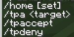

# Homeland Mod

**Homeland** is an open-source mod that brings useful commands to your **single-player world** or **server**. Some of the key commands include:

- `/tpa`
- `/home`
- `/home set`
- And many more...

## Key Features

The main features currently in development of **Homeland** include:

- A **minimap** with world waypoints
- **Multiple home locations**
- Support for **modded dimensions**
- Different base sector locations
- **Customizable commands** for better control
- And much more!

**Please note that the features above are very experimental and may not be available until the mod is completely finished**

### Command List

Here are some of the available commands in **Homeland**:

- **`/home`**: Teleport to your saved home.
- **`/home set`**: Set your current location as a home.
- **`/tpa <target>`**: Send a teleportation request to another player.
- **`/tpaccept`**: Accept a teleportation request.
- **`/tpdeny`**: Deny a teleportation request.

#### Screenshots

Here are some screenshots showcasing the commands:
-

*`/tpa` and `/tpaccept` commands in use.*

*The `/home` command interface.*

*Overview of available commands.*

## Contribution

Feel free to contribute to **Homeland**! This mod was made by someone who does not know what they are doing so all help is appreciated.

---

**Homeland** is designed to enhance your Minecraft experience by adding useful commands and features, making your world or server more enjoyable to play in.

